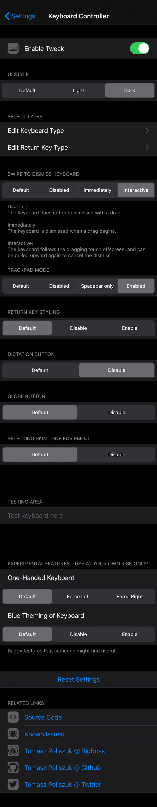
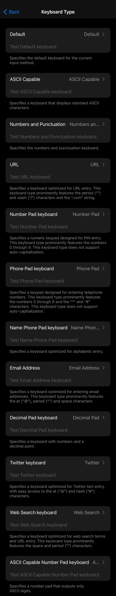

# Keyboard Controller
Control your Keyboard

## Compatibility
iOS 8 and above

## Features:
* UI Style (Default, Light, Dark)
* Keyboard Type:
	- Default
	- ASCII Capable
	- Numbers and Punctuation
	- URL
	- Number Pad
	- Phone Pad
	- Name Phone Pad
	- Email Address
	- Decimal Pad
	- Twitter
	- Web Search
	- ASCII Capable Number Pad (iOS 10+)
* Return Key Type:
	- Default
	- Go
	- Google
	- Join
	- Next
	- Route
	- Search
	- Send
	- Yahoo
	- Done
	- Emergency Call
	- Continue (iOS 9+)
* Swipe to dismiss keyboard (Default, Disabled, Immediately, Interactive)
* Trackpad mode (Default, Disabled, Spacebar only, Enabled) (iOS 12+)
* Dictation Button (Default, Disable) (iOS 10+)
* Globe Button (Default, Disable) (iOS 11+)
* Return key styling (Default, Disable, Enable)
* Selecting skin tone for emoji (Default, Disable)
* Beta Options:
	- One-Handed Keyboard (Default, Force Left, Force Right) (iOS 11+)
	- Blue Theming of Keyboard (Default, Disable, Enable)

**Configure options from Settings.**

## Screenshots:

