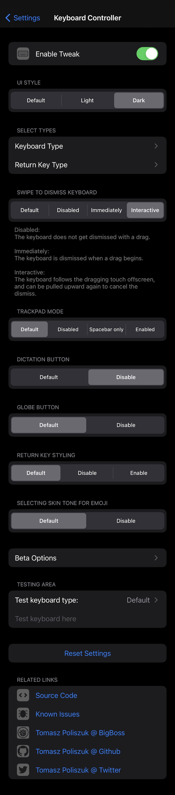
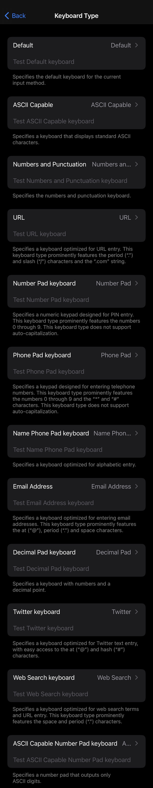
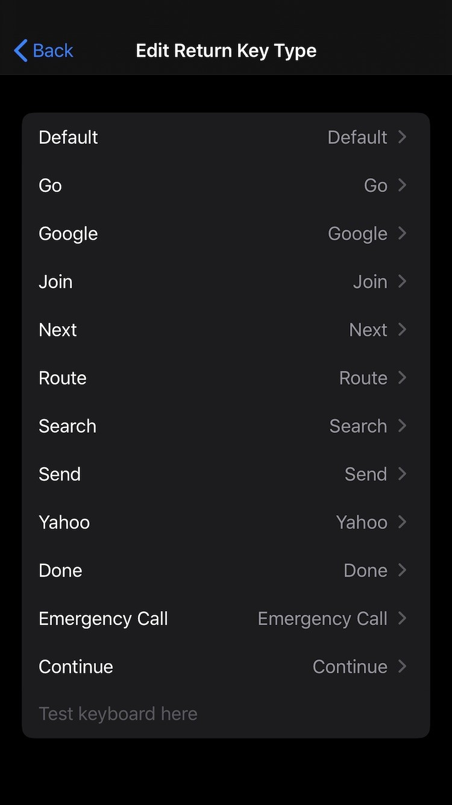

*Keyboard Controller - Control your Keyboard*

**Requires iOS greater or equal to 13**

**Possibilities:**
- UI Style (Default, Light, Dark)
- Dictation Button (Default, Disable)
- Select Types:
- - Edit Keyboard Type:
- - - Default
- - - Numbers and Punctuation
- - - URL
- - - Email Address
- - - ASCII Capable
- - - Web Search
- - - Alphabet
- - - Name Phone Pad
- - - Twitter
- - - Number Pad
- - - Decimal Pad
- - - Phone Pad
- - - ASCII Capable Number Pad
- - Edit Return Key Type:
- - - Default
- - - Go
- - - Google
- - - Join
- - - Next
- - - Route
- - - Search
- - - Send
- - - Yahoo
- - - Done
- - - Emergency Call
- - - Continue
- Swipe to dismiss keyboard (Default, Disabled, Immediately, Interactive)

Configure options from Settings.

**Screenshots:**

