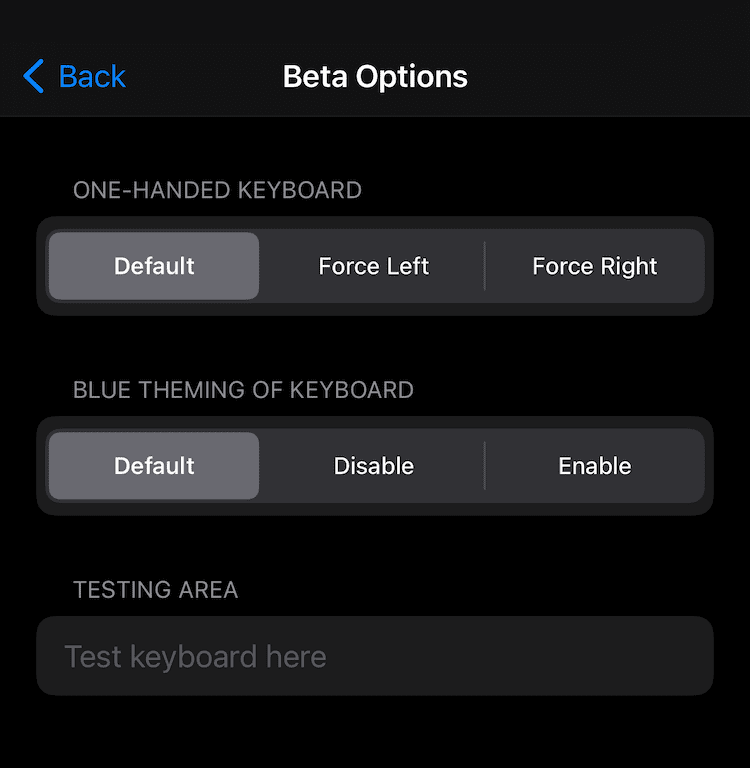

# Keyboard Controller
Control your Keyboard

## Compatibility
iOS 12 and above

## What you can do with this tweak:
* UI Style (Default, Light, Dark)
* Edit Keyboard Type:
	- Default
	- Numbers and Punctuation
	- URL
	- Email Address
	- ASCII Capable
	- Web Search
	- Alphabet
	- Name Phone Pad
	- Twitter
	- Number Pad
	- Decimal Pad
	- Phone Pad
	- ASCII Capable Number Pad
* Edit Return Key Type:
	- Default
	- Go
	- Google
	- Join
	- Next
	- Route
	- Search
	- Send
	- Yahoo
	- Done
	- Emergency Call
	- Continue
* Swipe to dismiss keyboard (Default, Disabled, Immediately, Interactive)
* Trackpad mode (Default, Disabled, Spacebar only, Enabled)
* Return key styling (Default, Disable, Enable)
* Dictation Button (Default, Disable)
* Globe Button (Default, Disable)
* Selecting skin tone for emoji (Default, Disable)
* Experimental features (Buggy features that someone might find useful):
	- One-Handed Keyboard (Default, Force Left, Force Right)
	- Blue Theming of Keyboard (Default, Disable, Enable)

**Configure options from Settings.**

## Screenshots:

